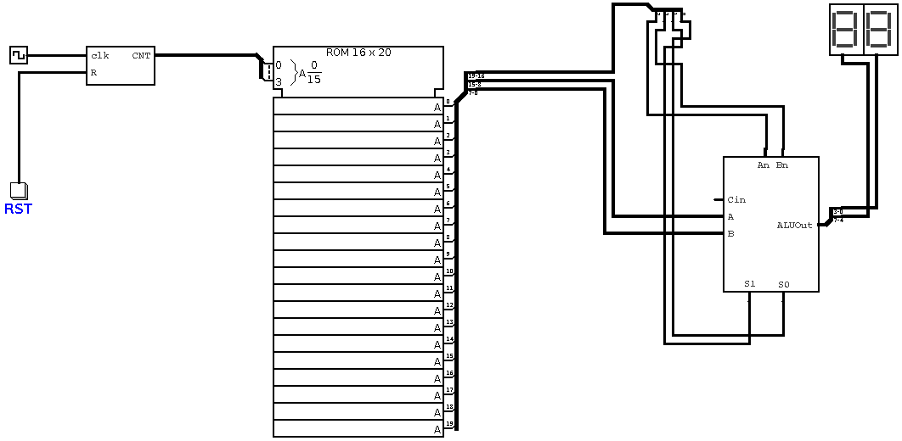

# 8-bit Programmable computer

## About this computer

This is an awesome experience, about implementation of 8-bit programmable computer. This computer is made up of a ROM and an ALU. Programs should be converted to HEX code and then be uploaded on ROM, it'll start to execute them. In this `README.md` file, you'll find out how this computer is designed and how it exactly works!

## Instruction Set Architecture

This computer, includes 4 ALU options, An, Bn, S1 and S0. S1 and S0 pins are connected to a multiplexer and they do selection of results. An & Bn pins, do invertion on operands A and B. They are used for implementing NOR, NAND and SUB functions. 

| An | Bn | S1 | S0 | Function |
|:---| ---| ---| ---| --------:|
