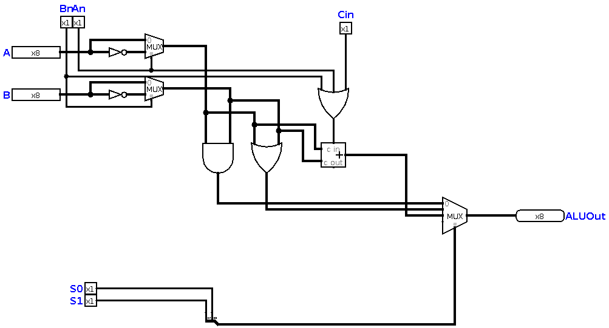

# 8-bit Programmable computer


## About this computer

This is an awesome experience, about implementation of 8-bit programmable computer. This computer is made up of a ROM and an ALU. Programs should be converted to HEX code and then be uploaded on ROM, it'll start to execute them. In this `README.md` file, you'll find out how this computer is designed and how it exactly works!

## Instruction Set Architecture

This computer, includes 4 ALU options, An, Bn, S1 and S0. S1 and S0 pins are connected to a multiplexer and they do selection of results. An & Bn pins, do invertion on operands A and B. They are used for implementing NOR, NAND and SUB functions. 

| An | Bn | S1 | S0 | Function |
|:---| ---| ---| ---| ---------|
| 0  | 0  | 0  | 0  | AND A, B |
| 0  | 0  | 0  | 1  | OR A, B  |
| 0  | 0  | 1  | 0  | ADD A, B |
| 0  | 1  | 1  | 0  | SUB A, B |
| 1  | 1  | 0  | 0  | NOR A, B |
| 1  | 1  | 0  | 1  | NAND A,B |

### The HEX code
It's very very easy to make hex code for an operation. What you need to consider is this table :

| ALUCode | Operand A | Operand B |
|:------- | --------- | ----------|
| 4 bits  | 8 bits    | 8 bits    |
| bits 16-19 | bits 8-15 | bits 0-7  |

That's all, a 20 bit binary number, or 5-digit hexadecimal expression. Consider this operation :

```
ADD 15, 2
```
| ALUCode | Operand A | Operand B |
|:------- | --------- | ----------|
| 0010 | 00001111 | 00000010 |
| 2    | 0f       | 02       |

The HEX code we got is `20f02`. We can upload this to our ROM now, and see the result!

##The ALU
 

This ALU is made up of :

1. 3 multilpexers ( One 8-bit 4x1 mux for selecting result of operations, two 1-bit 2x1 mux for swtiching between `A` or `~A` (`B` or `~B`))
2. 8-bit AND gate
3. 8-bit OR gate
4. 1-bit OR gate, which can make 2's complement of B for us. 
5. 2 8-bit NOT gates (for making NOR and NAND logics, and implemetation of SUB function). 
